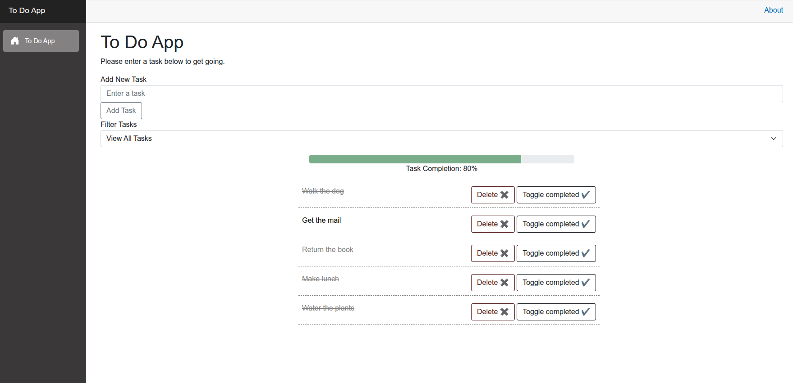
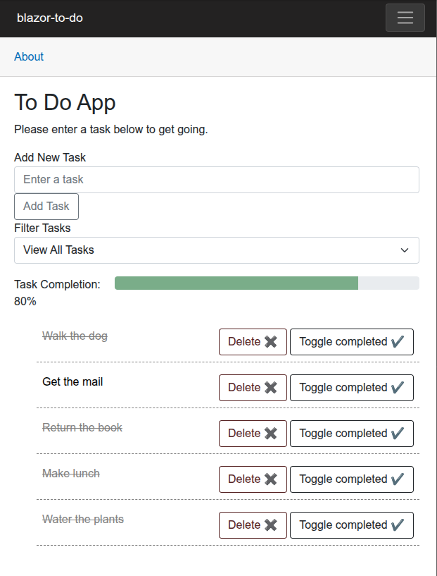

# Blazor To-Do App

A small project I built to **explore Blazor, C#, and .NET** and learn. This app helped me experiment with state management, event handling, local storage persistence, and filtering.

---

## Features

- **Add tasks** – Type and add new tasks to your list.
- **Delete tasks** – Remove tasks you no longer need.
- **Toggle completion** – Mark tasks as completed or undo them.
- **Persistent storage** – Tasks are saved to `localStorage` and persist across browser sessions.
- **Filter tasks** – View all tasks, only pending tasks, or only completed tasks.
- **Progress tracking** – A progress bar shows the percentage of tasks completed.

---

## Screenshots

Screenshots for desktop and mobile:




---

## What I Explored

This project was a learning exercise for me. I wanted to try out:

- **LocalStorage interop** (saving/loading tasks).
- **CRUD operations** (add, delete, mark as complete).
- **Data binding** (two-way binding for task input).
- **Conditional rendering** (e.g., strikethrough for completed tasks).
- **Filtering with LINQ** (using `IEnumerable<TaskItem>` and `Where` to filter tasks).
- **Reactive UI updates** (automatically updating the task list and progress bar when tasks change).

---

## Running Locally

1. **Prerequisites**:
   - [.NET SDK](https://dotnet.microsoft.com/download) (version 8.0 or later).

2. **Run the app**:
   ```
   dotnet run
   ```

Open the URL displayed in the terminal (usually http://localhost:5192 or similar).

## License

- The code in this repository is licensed under the [MIT License](./LICENSE).
